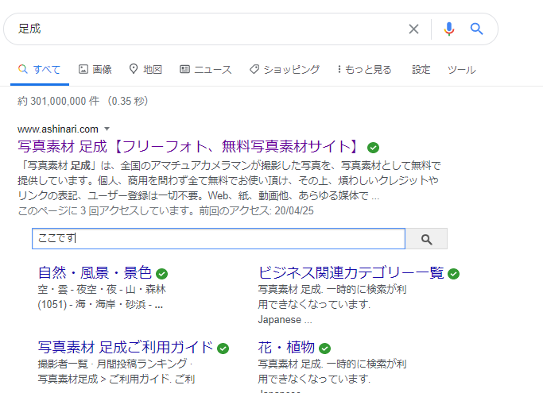
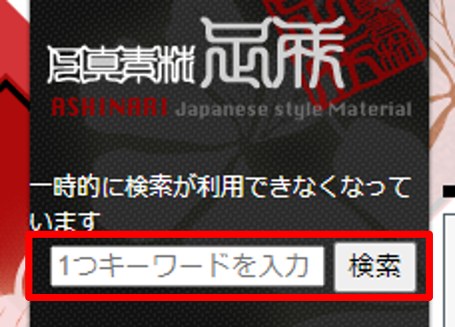
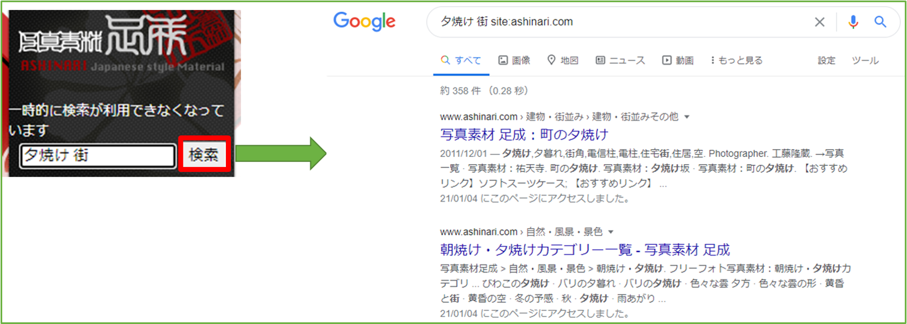

# AshinariPhotoSearcher

フリー写真サイト「足成」さまの検索を楽にするツール。\
[写真素材　足成](http://www.ashinari.com)

フリーの写真を探している際に、「足成」さまを頻繁に利用させていただいております。\
現在検索機能が利用できないということで、一つのアイディアとして、\
Googleで「写真素材　足成」を検索するとサイト内検索フォームが検索結果に出ているので、そこから検索できます。[^1]\
このツールは上記検索を「足成」さまのサイトから実行し、Googleの検索結果ページに飛ぶ、というツール。\
「足成」さまのサイトからGoogleに戻る必要が減り、検索が楽になるかと思います。\

[^1]:https://siodimaly.hateblo.jp/entry/20200509/1589003382
//TRPGをやるときに便利なサイトさんまとめ

## 前提条件
* ブラウザのアドオンにて動作します。
  * Firefoxなら [Grease Monkey](https://addons.mozilla.org/ja/firefox/addon/greasemonkey/)
  * Chrome or Vivaldiなら [Tampermonkey](https://chrome.google.com/webstore/detail/tampermonkey/dhdgffkkebhmkfjojejmpbldmpobfkfo?hl=ja)
  * ※他のブラウザでの動作検証はしていません。

## 導入方法
1. ブラウザのアドオンをインストールしてください。
  * Firefoxなら [Grease Monkey](https://addons.mozilla.org/ja/firefox/addon/greasemonkey/)
  * Chrome or Vivaldiなら [Tampermonkey](https://chrome.google.com/webstore/detail/tampermonkey/dhdgffkkebhmkfjojejmpbldmpobfkfo?hl=ja)
  * ※他のブラウザでの動作検証はしていません。
2. Github 上ののプログラムファイルページ [Ashinari_Photo_Searcher.user.js](Ashinari_Photo_Searcher.user.js) にて、上段右の 「Raw」と書かれたボタンを押下。\

3. アドオンのページで「インストール」をクリックすることで導入完了。

## 使い方
「足成」さまのページを認識して自動で検索BOXが生成されます。\
\
検索ボックス内に文字を入力し、検索ボタンを押すことで、Googleのページへ遷移します。\

## 無効化・削除方法
各ブラウザのアドオンの設定から無効化・削除を実施してください。

